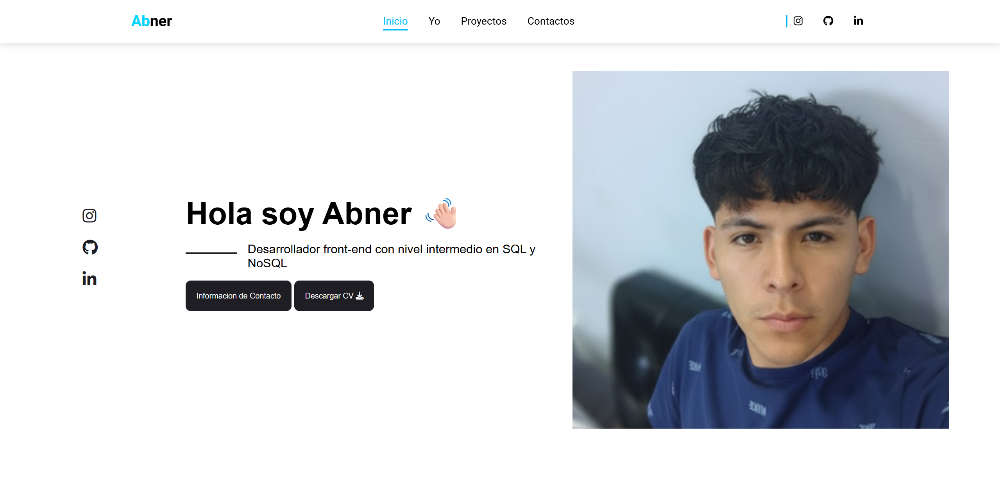

---

# Portafolio de Abner Gonzales

🚀 **¡Bienvenido a mi Portafolio!** Este es mi portafolio personal donde muestro mis **proyectos**, **habilidades** e **información de contacto**. Construido como parte de mi formación en Ingeniería de Software.

---

## 🚀 Demo en Vivo
[Ver el sitio en vivo](https://portafolio-abnergonzales.netlify.app/contact)

---

## 🌟 Secciones del Sitio Web

- **Inicio (`index.html`)**: Introducción al desarrollador con una breve descripción.
- **Sobre Mí (`sobremi.html`)**: Mi experiencia, *stack* tecnológico, habilidades y un poco sobre mí.
- **Proyectos (`proyectos.html`)**: Galería de proyectos con imágenes, descripciones y tecnologías usadas.
- **Contacto (`contactos.html`)**: Formulario de contacto y enlaces a mis redes sociales.

---

## ✨ Características

- **Diseño Responsivo:** Funciona perfectamente en computadoras, tablets y móviles.
- **Galería de Proyectos:** Muestra de mis trabajos con descripciones y tecnologías.
- **Tarjetas Interactivas:** Efectos *hover* para mostrar mis habilidades y servicios.
- **Página de Contacto:** Formulario funcional y enlaces directos a mis perfiles.
- **UI/UX Moderna:** Un diseño limpio y profesional.

---

## 🛠️ Tecnologías Utilizadas

- **HTML5**
- **CSS3** (Flexbox & Grid)
- **JavaScript**
- **Font Awesome** (para íconos)
- **Git & GitHub**
- **Angular**
- **Node.js**
- **SQL Server**

---

## 📂 Estructura del Proyecto

(Esta estructura está basada en las capturas de tu VS Code)
Portafolio/ │ ├─ index.html # Página de Inicio ├─ sobremi.html # Página "Sobre Mí" ├─ proyectos.html # Página de Proyectos ├─ contactos.html # Página de Contacto ├─ styles.css # Hoja de estilos (Asumo el nombre) ├─ script.js # Archivo JavaScript (Asumo el nombre) ├─ images/ # Carpeta con imágenes └─ README.md # La documentación del proyecto ---

## 📌 Instalación

1.  Clona el repositorio:
    ```bash
    git clone [https://github.com/AbnerGA7/Portafolio.git](https://github.com/AbnerGA7/Portafolio.git)
    ```
2.  Navega a la carpeta del proyecto:
    ```bash
    cd Portafolio
    ```
3.  Abre `index.html` en tu navegador favorito para ver el sitio.

---

## 📬 Contacto

Puedes encontrarme en:

- **Email**: abner.gonzales.work@gmail.com
- **LinkedIn**: [linkedin.com/in/abnergonzales7](https://www.linkedin.com/in/abnergonzales7)
- **GitHub**: [github.com/AbnerGA7](https://github.com/AbnerGA7)
- **Instagram**: [@abner_gonzales7](https://www.instagram.com/abner_gonzales7/)
- **Facebook**: [Abner Gonzales](https://web.facebook.com/abnerGonzalesA.7/)

---

Hecho con ❤️ por **Abner Gonzales**


