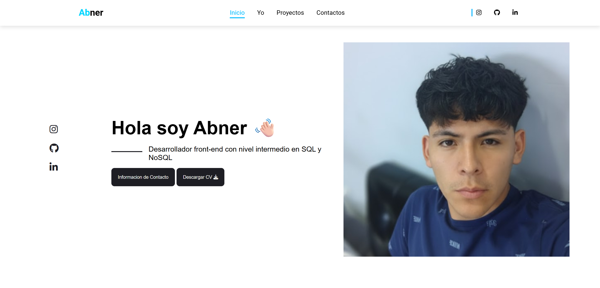

# Portafolio — Abner Gonzales

Portafolio personal construido con **Next.js 15 + Tailwind CSS**. Diseño dark minimalista con gradientes violet/cyan, scroll tipo página y modo responsivo para móvil.

## Demo en vivo

[portafolio-abnergonzales7.netlify.app](https://portafolio-abnergonzales7.netlify.app/)

---

## Secciones

| Sección | Descripción |
|---|---|
| **Hero** | Presentación con efecto typewriter y foto de perfil animada |
| **Sobre mí** | Skills con barras de progreso agrupadas por categoría |
| **Proyectos** | 6 proyectos con filtros por categoría y links a demos |
| **Contacto** | Formulario + redes sociales (WhatsApp, Instagram, Facebook, LinkedIn) |

---

## Stack

- **Next.js 15** — App Router, output export estático
- **React 19** — Componentes con `'use client'`
- **Tailwind CSS 3** — Tema personalizado, dark mode, animaciones
- **next/image** — Optimización de foto de perfil

---

## Skills mostradas

**Frontend:** React, React Native, Next.js, Angular, HTML/CSS, JavaScript, Tailwind CSS

**Backend & BD:** Node.js, Firebase/Firestore, SQL Server, Sanity CMS, Python, Java

**Mobile:** Android (Kotlin), Framer Motion, Recharts, jsPDF/ExcelJS

**Herramientas:** Git & GitHub, Vite, Netlify/Vercel, Figma

---

## Instalación local

```bash
git clone https://github.com/AbnerGA7/Portafolio.git
cd Portafolio
npm install
npm run dev
```

Abre [http://localhost:3000](http://localhost:3000)

---

## Contacto

- **Email:** abner.gonzales.work@gmail.com
- **WhatsApp:** +51 904 100 380
- **LinkedIn:** [linkedin.com/in/abnergonzales7](https://www.linkedin.com/in/abnergonzales7)
- **Instagram:** [@abner_gonzales7](https://www.instagram.com/abner_gonzales7)
- **Facebook:** [abnerGonzalesA.7](https://www.facebook.com/abnerGonzalesA.7)
- **GitHub:** [github.com/AbnerGA7](https://github.com/AbnerGA7)

---

Hecho por **Abner Gonzales**
