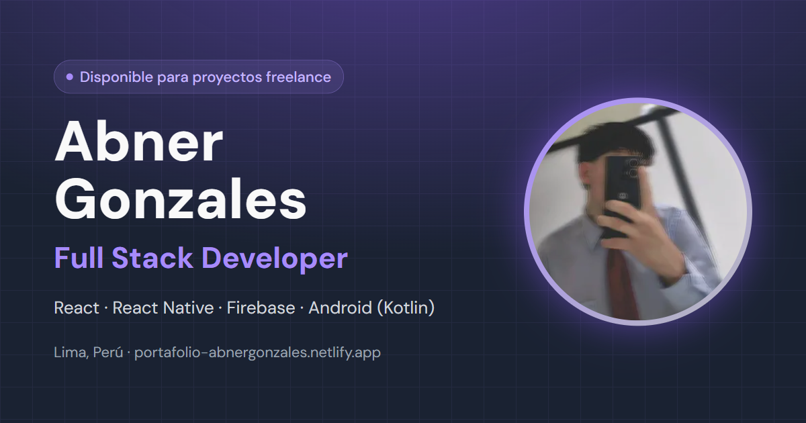

<div align="center">



# Abner Gonzales — Portafolio

**Full Stack Developer · React · Firebase · Android**

[](https://portafolio-abnergonzales.netlify.app/)
[](https://www.linkedin.com/in/abnergonzales7)
[](https://github.com/AbnerGA7)

</div>

---

## Sobre el proyecto

Portafolio personal construido con **Astro + React + Tailwind CSS v4**: sitio estático, rápido y bilingüe, con modo claro/oscuro, animaciones al hacer scroll y una escena 3D interactiva en la sección de habilidades.

## Características

- 🌍 **Bilingüe (ES / EN)** — rutas `/` (español) y `/en/` con selector de idioma
- 🌗 **Modo claro / oscuro** — respeta la preferencia del sistema y se recuerda entre visitas, sin parpadeo al cargar
- 🧊 **Escena 3D** con React Three Fiber en la sección de habilidades
- 🗂️ **Proyectos con filtros** por categoría (Web App, Mobile App, E-commerce, Landing Page) y estado (Producción, Completado, En desarrollo)
- 📬 **Formulario de contacto** funcional vía FormSubmit, además de WhatsApp, correo, LinkedIn, GitHub, Instagram y Facebook
- 🔎 **SEO** — Open Graph, Twitter Cards, `hreflang`, URL canónica y datos estructurados (Schema.org `Person`)
- ♿ **Accesibilidad** — foco visible con teclado, etiquetas ARIA y soporte para `prefers-reduced-motion`
- 📱 **Responsive** — diseñado para móvil, tablet y escritorio

## Secciones

| Sección | Contenido |
|---|---|
| **Inicio** | Presentación con efecto typewriter, foto y stack flotante |
| **Habilidades** | Tecnologías agrupadas por pestañas: Frontend, Mobile, Lenguajes, Backend & BD, Librerías y Herramientas |
| **Experiencia** | Desarrollo Full Stack freelance, desarrollo Android y formación en Ingeniería de Software |
| **Proyectos** | Las Torres, Smart Market Pro, GCorp Store, Admin Cactus, Bella Market Mobile y Exprésate |
| **Sobre mí** | Quién soy, mi enfoque y mi trayectoria |
| **Contacto** | Formulario y redes |

## Stack


## Estructura

```bash
src/
├── assets/       # Foto de perfil y capturas de proyectos
├── components/   # Secciones (home, skills, experience, projects, about, contact...)
│   └── */data/   # Contenido de cada sección (proyectos, skills, experiencia...)
├── data/         # Navegación y enlaces de contacto
├── i18n/         # Textos en español e inglés (ui.ts) y utilidades
├── layouts/      # Layout base con SEO
├── pages/        # Rutas: / y /[lang]/
├── react/        # Componentes React reutilizables (Typewriter, TabSwitcher)
├── styles/       # Estilos globales, tema y fuentes
└── types/        # Interfaces de TypeScript
```

## Instalación local

Requiere **Node.js 22.19+**.

```bash
git clone https://github.com/AbnerGA7/Portafolio.git
cd Portafolio
npm install
npm run dev
```

Abre [http://localhost:4321](http://localhost:4321)

| Comando | Acción |
|---|---|
| `npm run dev` | Servidor de desarrollo |
| `npm run build` | Genera el sitio estático en `dist/` |
| `npm run preview` | Sirve la build localmente |
| `npm run check` | Verificación de tipos con `astro check` |

## Personalización

- **Textos (ES/EN):** `src/i18n/ui.ts`
- **Proyectos:** `src/components/projects/data/projectsData.ts` (capturas en `src/assets/projects/`)
- **Habilidades:** `src/components/skills/data/techSkillsData.tsx`
- **Experiencia:** `src/components/experience/data/experienceData.ts`
- **Colores del tema:** variables en `src/styles/global.css`

## Despliegue

Se despliega en **Netlify** a partir de la rama `main` (`netlify.toml`: `npm run build` → `dist/`).

## Contacto

<div align="center">

[](mailto:abner.gonzales.work@gmail.com)
[](https://wa.me/51904100380)
[](https://www.instagram.com/abner_gonzales7)
[](https://www.facebook.com/abnerGonzalesA.7)

</div>

## Licencia

Distribuido bajo [Licencia MIT](LICENSE).

---

<div align="center">
Hecho con ❤️ por <strong>Abner Gonzales</strong>
</div>
